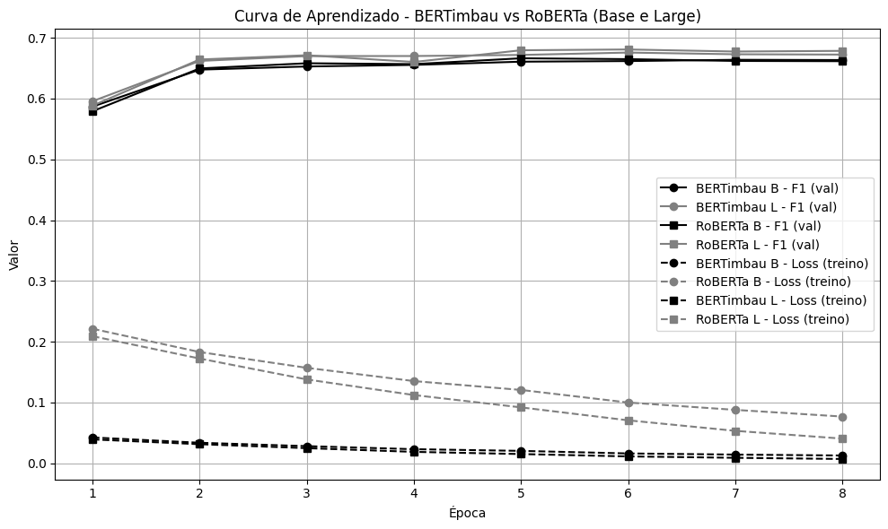

# DINÂMICA DO EMPREGO

## 1. Introdução e Objetivo
O projeto Dinâmica do Emprego busca acompanhar as vagas de emprego postadas pelos empregadores nas principais plataformas de divulgação, e realizar a análise das informações contidas nessas vagas no que tange à ocupação e as competências buscadas para cada profissional. Além disso, o objetivo final é realizar a compatibilização dessas informações com os cursos oferecidos pelo SENAC buscando assim compreender se a oferta está atualizada e pari passu com os ditames do mercado de trabalho.

Nas últimas décadas, o mercado de trabalho tem passado por transformações profundas impulsionadas por mudanças tecnológicas, econômicas e sociais. O avanço e difusão de novas tecnologias, como aquelas advindas da intensa digitalização, automação e inteligência artificial, bem como o crescimento de novas formas de organização do trabalho tem alterado significativamente o perfil das competências demandadas pelos empregadores. Profissões emergem, outras se transformam, e mesmo ocupações consolidadas são constantemente ressignificadas, exigindo dos trabalhadores uma atualização contínua de saberes, habilidades profissionais e atitudes.

Para que sejam passíveis de análise e acompanhamento faz-se necessária a implementação de técnicas de análise textual, tratamento de dados não estruturados e inteligência artificial. Neste contexto, o presente trabalho busca construir e explorar uma base de vagas de emprego, extraídas de três portais online, por meio de técnicas de Processamento de Linguagem Natural (PLN), com o objetivo de extrair e sistematizar informações sobre competências profissionais demandadas pelos empregadores diretamente das descrições das vagas. 

Ao mapear as habilidades, conhecimentos e atitudes requeridas em diferentes setores e ocupações, pretende-se subsidiar conhecimento e detalhamento de formação profissional e possibilitar tomadas de decisões mais alinhadas às transformações em curso contribuindo para a redução de defasagens entre oferta e demanda de trabalho qualificado. Além disso, pretende-se utilizar as informações para análise de cursos profissionais e técnicos do SENAC, com o intuito de sugerir e pautar possíveis atualizações, modernizações e reestruturações curriculares baseados nas demandas reais do mercado de trabalho atual.

## 2. Crawler e armazenamento de dados

Os dados utilizados nesse trabalho referem-se a vagas de emprego reais postadas por diferentes empresas em três portais de empregos. Para obter acesso a esses dados foi criado um crawler que busca as informações a cada dois dias e os armazena em banco de dados. Os dados apresentam características não estruturadas e passam por pequenas manipulações para identificar os campos e as informações que serão populadas nas tabelas armazenadas no banco. Esse processo leva em consideração três diferentes portais de vagas de emprego: i) Banco nacional de empregos , ii) Infojobs  e iii) Vagas . O início da raspagem desses dados se deu em Fevereiro de 2023 e é atualizado a cada três dias e consolidado mensalmente.

Os dados advindos do crawler são armazenados em:
- servidor "SRVVPRPDGPA01"
- Banco de dados: DBMercadoTrabalho
- Esquema: job_vacancy
- Tabela: job_vacancy_post

## 3. Metodologia de análise
### 3.1. Categorização Título - CBO
### 3.2. Extração de competências nas descrições das vagas: modelos BERT

Para a extração de competências das vagas de emprego foi necessário a conceituação de quais atributos são entendidos como uma competência. Para esse estudo utilizamos a conceituação advinda de Planos Curriculares Nacionais da instituição X de ensino profissional e tecnológica (EPT) de referência no Brasil. Assim, entende-se competência em três magnitudes:
- Habilidades: práticas, fazeres e ações. “consiste na realização de determinadas práticas de ordem motora, cognitiva, socioemocional e de relação interpessoal a serem mobilizadas”  na ocupação. Exemplos: ‘emissão de notas fiscais’, ‘análise quantitativa de dados’, ‘preparo e manipulação de alimentos’ 
- Conhecimentos: saberes que fundamentam a prática profissional. “Identificam, portanto, aquilo que o aluno precisa saber para desempenhar o fazer profissional descrito na competência”. Exemplos: ‘pacote office’, ‘Python’, ‘cortes de carnes’
- Atitudes e valores: “Relacionam-se às normas e aos juízos que influenciam a emissão de comportamentos nas mais diversas situações sociais que envolvem a prática profissional”. Exemplos: ‘ética’, ‘gostar de aprender’, ‘trabalho em equipe’.

A metodologia deste estudo foi baseada em três etapas principais, além da raspagem da base de dados: (i) construção da base de dados de treinamento anotada de vagas de emprego e competências, (ii) preparação e tokenização para tarefas de reconhecimento de entidades nomeadas (NER), e (iii) treinamento e avaliação de diferentes modelos baseados em BERT. A base de dados de treino foi gerada a partir de uma amostra de descrições reais de vagas de emprego extraídas de um banco com mais de 500 mil registros. A partir de uma amostra estratificada por setor de atividade, foi construída uma base com 10 mil descrições contendo diversidade linguística e semântica. A anotação das competências foi realizada em múltiplas etapas, utilizando um modelo de linguagem (GPT-4o) com prompt instruído a identificar spans textuais associados a cada tipo de competência, com base em uma lista expandida de termos previamente validados. Essa base foi revisada manualmente a partir de uma amostra aleatória por três pesquisadores da área de mercado de trabalho e educação. 	Além da base de exemplos reais, criou-se prompt solicitando ao GPT-4o que criasse descrições de emprego, com textos bem ajustados, de setores e ocupações diversas, extraindo as competências específicas de interesse ao projeto. Ao final, a base de dados utilizada nesse estudo é composta de 15 mil vagas de emprego e suas competências, sendo 13 mil vagas reais e 2 mil vagas ‘sintéticas’ e com exemplos bem ajustados. 	Os dados anotados foram processados com tokenização do tipo subword usando os respectivos tokenizers dos modelos Hugging Face. A base foi convertida para os esquemas de anotação BILOU. Os datasets foram divididos em 80% para treino e 20% para validação. 
	Seis modelos foram avaliados: 
- DistilBERT Multilingual (distilbert/distilbert-base-multilingual-cased) , 
- BERT Multilingual Base (google-bert/bert-base-multilingual-cased) , 
- RoBERTa Base treinado em português (thegoodfellas/tgf-xlm-roberta-base-pt-br) , 
- RoBERTa Large (FacebookAI/xlm-roberta-large) , 
- BERTimbau  Base (neuralmind/bert-base-portuguese-cased), 
- BERTimbau Large (neuralmind/bert-large-portuguese-case). 

Os modelos foram treinados por até 8 épocas com taxa de aprendizado de 2e-5, e batch size de 8. O treinamento foi conduzido com o Trainer da Hugging Face utilizando métricas personalizadas de precision, recall e F1-score, tanto nas formas micro quanto macro. Todos os treinamentos foram realizados em ambiente Python. Os modelos foram salvos e avaliados ao final de cada época com validação baseada no melhor F1.

#### 3.3.1. Resultados dos modelos BERT

Os modelos aqui experimentados revelam variações significativas no desempenho das arquiteturas aplicadas à tarefa NER em descrições de vagas de emprego. A Tabela 1 apresenta os valores de precision, recall e F1-score obtidos por cada modelo avaliado. Observa-se que os modelos de maior capacidade, como o BERTimbau Large (F1 = 0,676) e o RoBERTa Large (F1 = 0,681), apresentaram os melhores desempenhos gerais.

Entre os modelos base, destaca-se o BERTimbau Base (F1 = 0,661), que superou o DistilBERT (F1 = 0,626) e o BERT Multilingual (F1 = 0,654), reforçando a importância da especialização linguística e do treinamento com corpora em português brasileiro para capturar as especificidades morfológicas e sintáticas da língua. O RoBERTa Base obteve o melhor desempenho, embora ainda muito próximo do BERTimbau (F1 = 0,668), com leve vantagem em recall. 

##### Tabela 1. Estatísticas dos Modelos Utilizados

| Modelo              | Precision | Recall | F1   |
|---------------------|-----------|--------|------|
| DistilBERT          | 0,690     | 0,574  | 0,626 |
| BERT Multilingual   | 0,669     | 0,640  | 0,654 |
| RoBERTa (BR) Base   | 0,675     | 0,661  | 0,668 |
| BERTimbau Base      | 0,652     | 0,671  | 0,661 |
| RoBERTa Large       | 0,688     | 0,673  | 0,681 |
| BERTimbau Large     | 0,689     | 0,664  | 0,676 |

O BERTimbau apresentou um dos melhores desempenhos em F1-score micro (0,664 no modelo Large e 0,661 no Base), em patamares muito similares ao RoBERTa (0,681 no modelo Large e 0,668 no Base - PT_BR) nessa métrica, o que indica boa assertividade na extração de entidades mais frequentes (neste caso, as habilidades). Essa característica é particularmente relevante em bases com forte desequilíbrio entre categorias, como é o caso de descrições de vagas de emprego. 

Embora os modelos large tenham apresentado melhor performance em relação aos modelos base é importante ter em mente que esses modelos exigem maior capacidade de processamento e um elevado custo operacional. Assim, a escolha dos modelos BERTimbau fundamenta-se em sua sólida capacidade de extrair informações com alta precisão em língua portuguesa. 

A curva de aprendizado ao longo de oito épocas de treinamento, considerando o F1-score de validação e a loss sobre o conjunto de treino. Observa-se um comportamento consistente de aprendizado em todos os modelos, com crescimento rápido no F1-score nas primeiras três épocas e posterior estabilização. Em termos de loss, os modelos maiores também apresentam uma convergência mais acentuada e menor valor residual ao final do treinamento, especialmente o BERTimbau Large, cuja perda permanece abaixo dos demais. Esses resultados indicam não apenas maior capacidade de generalização dos modelos de maior porte, como também uma adaptação mais eficaz ao domínio específico das descrições de vagas de emprego.

### 4. Prévia dos resultados

